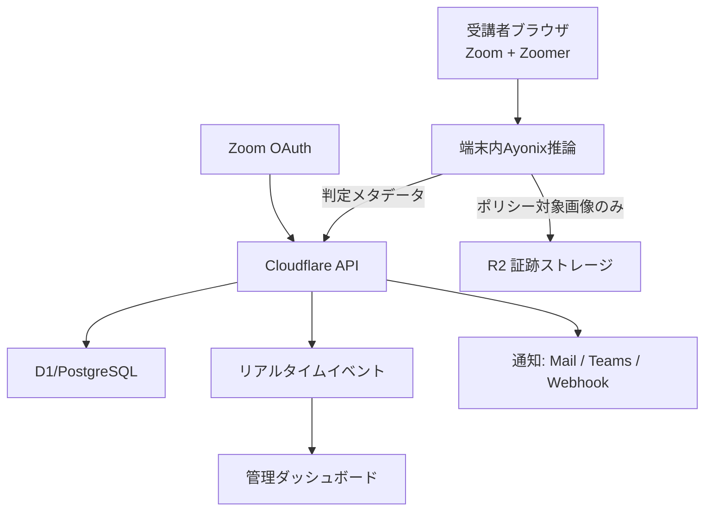

# Ayonix Zoomer アーキテクチャ

## 1. 要件

- Zoomを利用する研修へ追加導入できること
- 顔認証、継続認証、離席、複数人、居眠り疑いを低遅延で検知
- 顔画像の外部送信を最小化し、日本企業向けの監査要件に対応
- 受講者数の増減に合わせて水平スケール

## 2. 推奨構成

### 2.1 受講者側

- Zoomミーティングは通常どおり利用
- 別タブまたは埋込型のZoomer受講画面で、本人のカメラを明示的に許可
- Ayonix Web SDK／ネイティブ補助アプリで顔特徴抽出・状態推定
- 原則として端末内推論し、サーバーへは結果と必要最小限の証跡のみ送信

### 2.2 管理側

- React管理画面
- WebSocketまたはServer-Sent Eventsでアラート受信
- 研修単位、受講者単位、重要度単位で監視
- 画像は短時間の署名URLで取得し、URLをログやCSVへ保存しない

### 2.3 バックエンド

- API Gateway / Workers: 認証、入力検証、レート制限、テナント分離
- Event service: 判定イベントの順序保証、重複排除、ルール評価
- Evidence service: 画像暗号化、ハッシュ、保持期限、削除ジョブ
- Reporting service: CSV／PDF／監査ZIPを非同期生成
- Integration service: Zoom OAuth、Teams、メール、Webhook

## 3. Zoom連携

- Zoom OAuthで研修予定、ミーティングID、開催状態、参加メタデータを同期
- Zoomの通常クライアント映像を外部から直接取得することを前提にしない
- カメラ映像は受講者のZoomer画面から本人同意の下で取得
- 顧客がZoom Video SDKによる完全埋込会議を採用する場合は、別フェーズでSDK可否・契約・性能を検証

## 4. データモデル

- Organization, User, Role, Permission
- Trainee, FaceEnrollment, Consent
- TrainingSession, SessionParticipant, ZoomMeeting
- MonitoringEvent, Alert, AlertReview
- EvidenceObject, RetentionPolicy
- NotificationRule, Integration
- AuditLog, ModelVersion, RuleVersion

すべての業務テーブルに `organization_id` を持たせ、アプリケーション層とDB層の両方でテナント分離を強制します。

## 5. デプロイ

- 開発／ステージング／本番を完全分離
- IaCで環境を再現
- Blue/Greenまたは段階リリース
- 推論モデルとルールは独立バージョン管理
- 監視: API遅延、イベント遅延、キュー滞留、誤検知率、保存失敗、通知失敗
